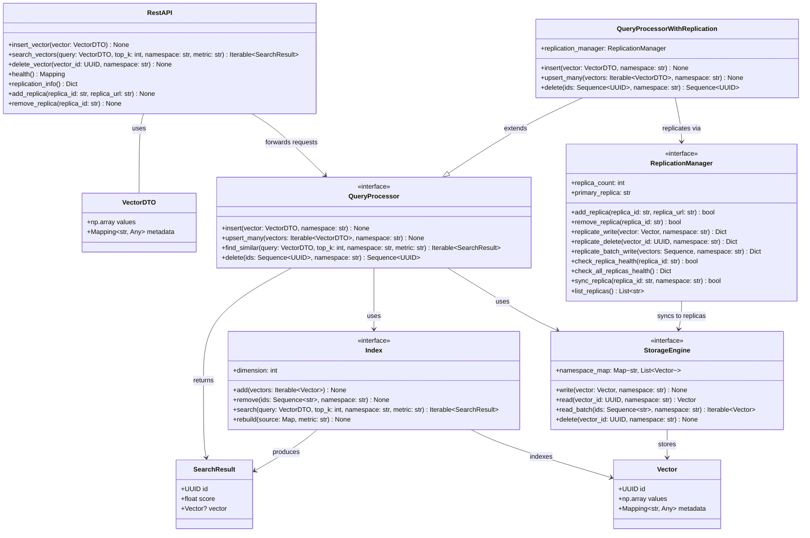

# MLVectorDB

A Vector Database implementation for Big Data Infrastructure course (Infrastructure for Big Data / Foundations of High-Load Application Design).

MLVectorDB is a Python-based vector database system designed to efficiently store, index, and query high-dimensional vectors. It provides a clean interface architecture using Python Protocols, making it extensible and easy to implement different storage engines, indexing algorithms, and query processors.

## Features

- **Protocol-based Architecture**: Clean interfaces defined using Python Protocols for maximum flexibility
- **Vector Operations**: Support for distance calculations, similarity searches, and vector normalization
- **Modular Design**: Separate components for storage, indexing, and query processing
- **REST API**: Full HTTP API for accessing QueryProcessor functionality with FastAPI
- **Multiple Query Types**: KNN, range search, similarity search, metadata filtering, and hybrid queries
- **Extensible**: Easy to implement custom storage engines, index types, and query processors
- **Type Safe**: Full type hints and Protocol compliance checking
- **Production Ready**: Comprehensive logging, error handling, and API documentation
- **Replication Support**: Built-in replication for high availability and fault tolerance

## Installation

```bash
pip install -e .
```

## Quick Start

### Using the Vector Classes Directly

```python
import numpy as np
from mlvectordb.implementations.simple_vector import SimpleVector

# Create vectors
vector1 = SimpleVector("doc1", np.array([1.0, 2.0, 3.0]), {"category": "text"})
vector2 = SimpleVector("doc2", np.array([2.0, 3.0, 4.0]), {"category": "text"})

# Calculate distance and similarity
distance = vector1.distance(vector2, metric="euclidean")
similarity = vector1.similarity(vector2, metric="cosine")

print(f"Distance: {distance}")
print(f"Similarity: {similarity}")
```

### Using the REST API

Start the API server:

```bash
python -m mlvectordb.api.server --port 8000
```

Then make HTTP requests:

```bash
# Health check
curl http://localhost:8000/health

# KNN query
curl -X POST http://localhost:8000/query/knn \
  -H "Content-Type: application/json" \
  -d '{
    "type": "knn",
    "vector": [1.0, 2.0, 3.0],
    "k": 5
  }'

# Range query
curl -X POST http://localhost:8000/query/range \
  -H "Content-Type: application/json" \
  -d '{
    "type": "range", 
    "vector": [0.5, 1.5, 2.5],
    "radius": 2.0
  }'
```

### API Documentation

Once the server is running, visit:
- Interactive API docs: `http://localhost:8000/docs`
- Alternative docs: `http://localhost:8000/redoc`

## Architecture Overview

MLVectorDB follows a layered architecture with the following core components:

### Protocol Interfaces

All components are defined as Python Protocols, ensuring type safety and enabling multiple implementations.



## Core Components

### 1. Vector (Protocol)

Represents a high-dimensional vector with metadata.

**Key Methods:**
- `distance(other, metric)` - Calculate distance to another vector
- `similarity(other, metric)` - Calculate similarity to another vector  
- `normalize()` - Return normalized vector
- `to_dict() / from_dict()` - Serialization support

**Attributes:**
- `id: str` - Unique identifier
- `data: np.ndarray` - Vector data
- `metadata: dict` - Associated metadata
- `dimension: int` - Vector dimensionality

**UML Representation:**
```
┌─────────────────────────────────────┐
│              Vector                 │
│               <<Protocol>>          │
├─────────────────────────────────────┤
│ + id: str                          │
│ + data: np.ndarray                 │
│ + metadata: Optional[dict]         │
│ + dimension: int                   │
├─────────────────────────────────────┤
│ + distance(other, metric): float   │
│ + similarity(other, metric): float │
│ + normalize(): Vector              │
│ + to_dict(): dict                  │
│ + from_dict(data): Vector          │
└─────────────────────────────────────┘
```

### 2. Index (Protocol)

Manages efficient indexing and searching of vectors.

**Key Methods:**
- `add_vector(vector)` - Add vector to index
- `search_knn(query, k)` - K-nearest neighbors search
- `range_search(query, radius)` - Range-based search
- `build_index()` - Build/rebuild index structure

**Attributes:**
- `name: str` - Index identifier
- `dimension: int` - Vector dimension
- `size: int` - Number of indexed vectors
- `index_type: str` - Algorithm type

**UML Representation:**
```
┌─────────────────────────────────────┐
│               Index                 │
│               <<Protocol>>          │
├─────────────────────────────────────┤
│ + name: str                        │
│ + dimension: int                   │
│ + size: int                        │
│ + index_type: str                  │
├─────────────────────────────────────┤
│ + add_vector(vector): bool         │
│ + add_vectors(vectors): List[bool] │
│ + search_knn(query, k): List[...]  │
│ + range_search(query, r): List[...]│
│ + build_index(): bool              │
│ + save_index(path): bool           │
│ + load_index(path): bool           │
└─────────────────────────────────────┘
```

### 3. StorageEngine (Protocol)

Handles persistent storage and retrieval of vectors.

**Key Methods:**
- `store_vector(vector)` - Persist vector
- `retrieve_vector(id)` - Load vector by ID
- `query_by_metadata(filter)` - Filter by metadata
- `iterate_vectors()` - Batch iteration

**Attributes:**
- `storage_type: str` - Storage backend type
- `total_vectors: int` - Number of stored vectors
- `storage_size: int` - Storage size in bytes

**UML Representation:**
```
┌─────────────────────────────────────┐
│           StorageEngine             │
│               <<Protocol>>          │
├─────────────────────────────────────┤
│ + storage_type: str                │
│ + total_vectors: int               │
│ + storage_size: int                │
├─────────────────────────────────────┤
│ + store_vector(vector): bool       │
│ + retrieve_vector(id): Vector      │
│ + update_vector(vector): bool      │
│ + delete_vector(id): bool          │
│ + query_by_metadata(filter): List │
│ + iterate_vectors(): Iterator      │
│ + create_backup(path): bool        │
│ + restore_from_backup(path): bool  │
└─────────────────────────────────────┘
```

### 4. QueryProcessor (Protocol)

Handles query parsing, optimization, and execution.

**Key Methods:**
- `execute_knn_query()` - Execute k-NN search
- `execute_range_query()` - Execute range search
- `execute_hybrid_query()` - Combined vector/metadata search
- `parse_query()` - Parse query specification

**Attributes:**
- `supported_query_types: List[QueryType]` - Supported query types

**Query Types:**
- `KNN` - K-nearest neighbors
- `RANGE` - Range search
- `SIMILARITY` - Similarity search  
- `METADATA` - Metadata filtering
- `HYBRID` - Combined queries

**UML Representation:**
```
┌─────────────────────────────────────┐
│           QueryProcessor            │
│               <<Protocol>>          │
├─────────────────────────────────────┤
│ + supported_query_types: List      │
├─────────────────────────────────────┤
│ + parse_query(query): dict         │
│ + optimize_query(parsed): dict     │
│ + execute_knn_query(...): List     │
│ + execute_range_query(...): List   │
│ + execute_similarity_query(): List │
│ + execute_metadata_query(): List   │
│ + execute_hybrid_query(...): List  │
│ + execute_query(query): dict       │
│ + explain_query(query): dict       │
└─────────────────────────────────────┘
```

### 5. REST API

FastAPI-based REST interface providing HTTP access to QueryProcessor functionality.

**Key Endpoints:**
- `GET /health` - Health check and status
- `POST /query/knn` - K-nearest neighbors search
- `POST /query/range` - Range search
- `POST /query/similarity` - Similarity search
- `POST /query/metadata` - Metadata filtering
- `POST /query/hybrid` - Hybrid queries
- `POST /query/explain` - Query execution plans
- `GET /statistics` - Query processor statistics

**Features:**
- OpenAPI/Swagger documentation at `/docs`
- Pydantic request/response validation
- Comprehensive error handling
- CORS support for web applications
- Query statistics tracking
- Result caching capabilities
- Replication management endpoints

### 6. ReplicationManager (Protocol)

Manages data replication across multiple storage replicas for high availability and fault tolerance.

**Key Methods:**
- `add_replica(replica_id, replica_url)` - Add a new replica
- `remove_replica(replica_id)` - Remove a replica
- `replicate_write(vector, namespace)` - Replicate vector write to all replicas
- `replicate_delete(vector_id, namespace)` - Replicate vector deletion
- `replicate_batch_write(vectors, namespace)` - Batch replication
- `check_replica_health(replica_id)` - Check single replica health
- `check_all_replicas_health()` - Check all replicas health
- `sync_replica(replica_id)` - Full synchronization of a replica

**Attributes:**
- `replica_count: int` - Number of active healthy replicas
- `primary_replica: str` - Primary replica identifier

**Features:**
- Dynamic replica addition/removal without restart
- Automatic health checking of replicas
- Asynchronous replication (non-blocking writes)
- Error handling with graceful degradation
- Batch operations support

**UML Representation:**
```
┌─────────────────────────────────────┐
│        ReplicationManager           │
│            <<Protocol>>             │
├─────────────────────────────────────┤
│ + replica_count: int               │
│ + primary_replica: str             │
├─────────────────────────────────────┤
│ + add_replica(id, url): bool       │
│ + remove_replica(id): bool         │
│ + replicate_write(vec, ns): Dict   │
│ + replicate_delete(id, ns): Dict   │
│ + replicate_batch_write(...): Dict │
│ + check_replica_health(id): bool   │
│ + check_all_replicas_health(): Dict│
│ + sync_replica(id, ns): bool       │
│ + list_replicas(): List[str]       │
└─────────────────────────────────────┘
```

## Replication

MLVectorDB supports data replication for high availability and fault tolerance. When replication is enabled, all write operations are automatically propagated to configured replicas.

### Replication Architecture

```
┌─────────────────────┐
│   Primary Node      │
│  ┌───────────────┐  │
│  │ StorageEngine │  │
│  │   (Master)    │  │
│  └───────────────┘  │
│         │           │
│  ┌──────▼────────┐  │
│  │ Replication   │  │
│  │   Manager     │  │
│  └──────┬────────┘  │
└─────────┼───────────┘
          │ HTTP API
          │
  ┌───────┴───────┐
  │               │
  ▼               ▼
┌─────────┐   ┌─────────┐
│Replica 1│   │Replica 2│
│ :8001   │   │ :8002   │
└─────────┘   └─────────┘
```

### Enabling Replication

#### Server with Replication

```bash
python -m mlvectordb.api.server --enable-replication --port 8000
```

#### Programmatic API

```python
from mlvectordb.implementations.storage_engine_in_memory import StorageEngineInMemory
from mlvectordb.implementations.index import Index
from mlvectordb.implementations.replication_manager import ReplicationManagerImpl
from mlvectordb.implementations.query_processor_with_replication import QueryProcessorWithReplication

# Create primary storage and replication manager
primary_storage = StorageEngineInMemory()
replication_manager = ReplicationManagerImpl(
    primary_storage=primary_storage,
    primary_replica_id="primary",
    health_check_interval=5.0  # Health check every 5 seconds
)

# Add replicas
replication_manager.add_replica("replica_1", "http://localhost:8001")
replication_manager.add_replica("replica_2", "http://localhost:8002")

# Create QueryProcessor with replication support
qproc = QueryProcessorWithReplication(
    storage_engine=primary_storage,
    index=Index(),
    replication_manager=replication_manager
)

# Vector insertions are automatically replicated
from mlvectordb.interfaces.vector import VectorDTO
vector = VectorDTO(values=[1.0, 2.0, 3.0], metadata={"category": "test"})
qproc.insert(vector, namespace="default")
```

### Replication REST API

```bash
# Get replication info
curl http://localhost:8000/replication/info

# Add a replica
curl -X POST "http://localhost:8000/replication/replicas?replica_id=replica_1&replica_url=http://localhost:8001"

# Remove a replica
curl -X DELETE http://localhost:8000/replication/replicas/replica_1

# Check replica health
curl http://localhost:8000/replication/replicas/replica_1/health

# Check all replicas health
curl http://localhost:8000/replication/replicas/health
```

### Replication Features

| Feature | Description |
|---------|-------------|
| **Dynamic Management** | Add/remove replicas without service restart |
| **Health Monitoring** | Automatic background health checks |
| **Async Replication** | Non-blocking write operations |
| **Error Tolerance** | Writes succeed even if replicas are unavailable |
| **Batch Support** | Efficient bulk replication |
| **Full Sync** | Complete replica synchronization on demand |

## System Relationships

```
                                ┌─────────────────┐
                                │   API Client    │
                                │  (HTTP Requests)│
                                └────────┬────────┘
                                         │
                                         ▼
                          ┌──────────────────────────┐
                          │        REST API          │
                          │        (FastAPI)         │
                          └──────────────┬───────────┘
                                         │ uses
                                         ▼
┌─────────────────────────────────────────────────────────────────┐
│               QueryProcessorWithReplication                      │
│  ┌──────────────────────────────────────────────────────────┐   │
│  │                    QueryProcessor                        │   │
│  │  ┌─────────────────┐      ┌─────────────────┐            │   │
│  │  │      Index      │◄────►│ StorageEngine   │            │   │
│  │  │                 │      │   (Primary)     │            │   │
│  │  └─────────────────┘      └─────────────────┘            │   │
│  └──────────────────────────────────────────────────────────┘   │
│                              │                                   │
│                              │ replicates via                    │
│                              ▼                                   │
│                ┌─────────────────────────┐                       │
│                │   ReplicationManager    │                       │
│                └────────────┬────────────┘                       │
└─────────────────────────────┼───────────────────────────────────┘
                              │
              ┌───────────────┼───────────────┐
              │               │               │
              ▼               ▼               ▼
     ┌──────────────┐ ┌──────────────┐ ┌──────────────┐
     │  Replica 1   │ │  Replica 2   │ │  Replica N   │
     │  (HTTP API)  │ │  (HTTP API)  │ │  (HTTP API)  │
     └──────────────┘ └──────────────┘ └──────────────┘
```

## Development

### Running Tests

```bash
pytest tests/ -v
```

### Code Quality

```bash
# Type checking
mypy src/

# Code formatting
black src/ tests/
isort src/ tests/

# Linting
flake8 src/ tests/
```

### Project Structure

```
mlvectordb/
├── src/mlvectordb/
│   ├── interfaces/              # Protocol definitions
│   │   ├── vector.py
│   │   ├── index.py
│   │   ├── storage_engine.py
│   │   ├── query_processor.py
│   │   └── replication.py       # ReplicationManager protocol
│   ├── implementations/         # Concrete implementations
│   │   ├── vector.py
│   │   ├── index.py
│   │   ├── storage_engine_in_memory.py
│   │   ├── query_processor.py
│   │   ├── query_processor_with_replication.py  # Extended QueryProcessor
│   │   └── replication_manager.py               # ReplicationManager implementation
│   └── api/                    # REST API
│       ├── main.py             # FastAPI application
│       ├── models.py           # Pydantic models
│       └── server.py           # Server CLI
├── examples/                   # Usage examples
│   └── api_client.py          # API client example
├── tests/                     # Test suite
├── pyproject.toml            # Project configuration
├── REPLICATION_SHARDING.md   # Detailed replication/sharding docs
└── README.md                # This file
```

## API Examples

### Python Client

```python
from examples.api_client import MLVectorDBClient

client = MLVectorDBClient("http://localhost:8000")

# Health check
health = client.health_check()
print(f"Status: {health['status']}")

# KNN search
results = client.knn_query(
    vector=[1.0, 2.0, 3.0],
    k=5
)
print(f"Found {results['total_results']} results")

# Query statistics  
stats = client.get_statistics()
print(f"Total queries: {stats['total_queries']}")
```

### cURL Examples

```bash
# Start the server
python -m mlvectordb.api.server --port 8000

# Health check
curl http://localhost:8000/health

# Get supported query types
curl http://localhost:8000/query-types

# KNN Query
curl -X POST http://localhost:8000/query/knn \
  -H "Content-Type: application/json" \
  -d '{
    "type": "knn",
    "vector": [1.0, 2.0, 3.0],
    "k": 5
  }'

# Similarity Query
curl -X POST http://localhost:8000/query/similarity \
  -H "Content-Type: application/json" \
  -d '{
    "type": "similarity",
    "vector": [1.0, 0.0, 0.0],
    "threshold": 0.7,
    "metric": "cosine"
  }'

# Metadata Query
curl -X POST http://localhost:8000/query/metadata \
  -H "Content-Type: application/json" \
  -d '{
    "type": "metadata",
    "filter": {"category": "documents", "active": true}
  }'

# Query Explanation
curl -X POST http://localhost:8000/query/explain \
  -H "Content-Type: application/json" \
  -d '{
    "type": "knn",
    "vector": [1.0, 2.0, 3.0],
    "k": 10
  }'

# Get Statistics
curl http://localhost:8000/statistics
```

## Contributing

1. Implement new storage engines by following the `StorageEngine` protocol
2. Create new index types by implementing the `Index` protocol  
3. Add custom query processors using the `QueryProcessor` protocol
4. Extend vector functionality through the `Vector` protocol
5. Create custom replication strategies by implementing the `ReplicationManager` protocol

## Further Reading

- [Replication and Sharding Documentation](REPLICATION_SHARDING.md) - Detailed documentation on replication setup and configuration

## License

This project is developed as part of the Big Data Infrastructure course.
