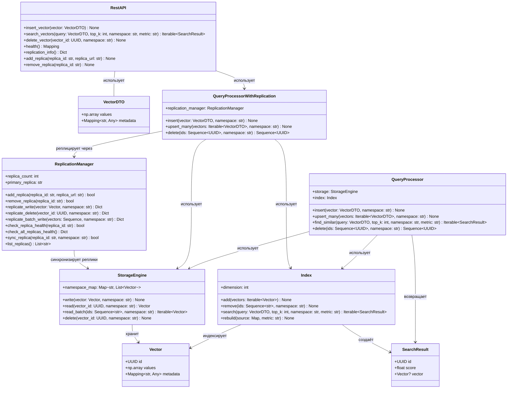

# MLVectorDB

Векторная база данных для курса "Инфраструктура больших данных" (Infrastructure for Big Data / Foundations of High-Load Application Design).

## Архитектура системы



MLVectorDB — это векторная база данных на Python, предназначенная для эффективного хранения, индексации и поиска многомерных векторов. Система предоставляет чистую архитектуру интерфейсов на основе Python Protocols, что делает её расширяемой и позволяет легко реализовывать различные движки хранения, алгоритмы индексации и процессоры запросов.

## Возможности

- **Архитектура на протоколах**: Чистые интерфейсы на Python Protocols для максимальной гибкости
- **Операции с векторами**: Расчёт расстояний, поиск похожих, нормализация векторов
- **Модульный дизайн**: Отдельные компоненты для хранения, индексации и обработки запросов
- **REST API**: Полноценный HTTP API для работы с QueryProcessor через FastAPI
- **Множество типов запросов**: KNN, поиск по радиусу, поиск похожих, фильтрация по метаданным, гибридные запросы
- **Расширяемость**: Легко добавлять собственные движки хранения, типы индексов и процессоры запросов
- **Типобезопасность**: Полная типизация и проверка соответствия протоколам
- **Production Ready**: Логирование, обработка ошибок и документация API
- **Поддержка репликации**: Встроенная репликация для высокой доступности и отказоустойчивости

## Установка

```bash
pip install -e .
```

## Быстрый старт

### Работа с классами векторов напрямую

```python
import numpy as np
from mlvectordb.implementations.simple_vector import SimpleVector

# Создание векторов
vector1 = SimpleVector("doc1", np.array([1.0, 2.0, 3.0]), {"category": "text"})
vector2 = SimpleVector("doc2", np.array([2.0, 3.0, 4.0]), {"category": "text"})

# Расчёт расстояния и сходства
distance = vector1.distance(vector2, metric="euclidean")
similarity = vector1.similarity(vector2, metric="cosine")

print(f"Расстояние: {distance}")
print(f"Сходство: {similarity}")
```

### Использование REST API

Запуск API сервера:

```bash
python -m mlvectordb.api.server --port 8000
```

HTTP запросы:

```bash
# Проверка здоровья
curl http://localhost:8000/health

# KNN запрос
curl -X POST http://localhost:8000/query/knn \
  -H "Content-Type: application/json" \
  -d '{
    "type": "knn",
    "vector": [1.0, 2.0, 3.0],
    "k": 5
  }'

# Запрос по радиусу
curl -X POST http://localhost:8000/query/range \
  -H "Content-Type: application/json" \
  -d '{
    "type": "range", 
    "vector": [0.5, 1.5, 2.5],
    "radius": 2.0
  }'
```

### Документация API

После запуска сервера доступны:
- Интерактивная документация: `http://localhost:8000/docs`
- Альтернативная документация: `http://localhost:8000/redoc`

## Основные компоненты

### 1. Vector (Протокол)

Представляет многомерный вектор с метаданными.

**Основные методы:**
- `distance(other, metric)` - Расчёт расстояния до другого вектора
- `similarity(other, metric)` - Расчёт сходства с другим вектором
- `normalize()` - Возврат нормализованного вектора
- `to_dict() / from_dict()` - Сериализация

**Атрибуты:**
- `id: str` - Уникальный идентификатор
- `data: np.ndarray` - Данные вектора
- `metadata: dict` - Связанные метаданные
- `dimension: int` - Размерность вектора

### 2. Index (Протокол)

Управляет эффективной индексацией и поиском векторов.

**Основные методы:**
- `add_vector(vector)` - Добавление вектора в индекс
- `search_knn(query, k)` - Поиск K ближайших соседей
- `range_search(query, radius)` - Поиск по радиусу
- `build_index()` - Построение/перестроение структуры индекса

**Атрибуты:**
- `name: str` - Идентификатор индекса
- `dimension: int` - Размерность вектора
- `size: int` - Количество проиндексированных векторов
- `index_type: str` - Тип алгоритма

### 3. StorageEngine (Протокол)

Обеспечивает персистентное хранение и извлечение векторов.

**Основные методы:**
- `store_vector(vector)` - Сохранение вектора
- `retrieve_vector(id)` - Загрузка вектора по ID
- `query_by_metadata(filter)` - Фильтрация по метаданным
- `iterate_vectors()` - Итерация по пакетам

**Атрибуты:**
- `storage_type: str` - Тип бэкенда хранения
- `total_vectors: int` - Количество сохранённых векторов
- `storage_size: int` - Размер хранилища в байтах

### 4. QueryProcessor (Протокол)

Обрабатывает парсинг, оптимизацию и выполнение запросов.

**Основные методы:**
- `execute_knn_query()` - Выполнение k-NN поиска
- `execute_range_query()` - Выполнение поиска по радиусу
- `execute_hybrid_query()` - Комбинированный поиск вектор/метаданные
- `parse_query()` - Парсинг спецификации запроса

**Типы запросов:**
- `KNN` - K ближайших соседей
- `RANGE` - Поиск по радиусу
- `SIMILARITY` - Поиск похожих
- `METADATA` - Фильтрация по метаданным
- `HYBRID` - Комбинированные запросы

### 5. REST API

REST интерфейс на FastAPI для HTTP доступа к функционалу QueryProcessor.

**Основные эндпоинты:**
- `GET /health` - Проверка здоровья и статус
- `POST /query/knn` - Поиск K ближайших соседей
- `POST /query/range` - Поиск по радиусу
- `POST /query/similarity` - Поиск похожих
- `POST /query/metadata` - Фильтрация по метаданным
- `POST /query/hybrid` - Гибридные запросы
- `POST /query/explain` - Планы выполнения запросов
- `GET /statistics` - Статистика процессора запросов

**Возможности:**
- OpenAPI/Swagger документация на `/docs`
- Pydantic валидация запросов/ответов
- Обработка ошибок
- CORS поддержка для веб-приложений
- Отслеживание статистики запросов
- Возможности кеширования результатов
- Эндпоинты управления репликацией

### 6. ReplicationManager (Протокол)

Управляет репликацией данных между несколькими репликами хранилища для высокой доступности и отказоустойчивости.

**Основные методы:**
- `add_replica(replica_id, replica_url)` - Добавление новой реплики
- `remove_replica(replica_id)` - Удаление реплики
- `replicate_write(vector, namespace)` - Репликация записи вектора на все реплики
- `replicate_delete(vector_id, namespace)` - Репликация удаления вектора
- `replicate_batch_write(vectors, namespace)` - Пакетная репликация
- `check_replica_health(replica_id)` - Проверка здоровья одной реплики
- `check_all_replicas_health()` - Проверка здоровья всех реплик
- `sync_replica(replica_id)` - Полная синхронизация реплики

**Атрибуты:**
- `replica_count: int` - Количество активных здоровых реплик
- `primary_replica: str` - Идентификатор первичной реплики

**Возможности:**
- Динамическое добавление/удаление реплик без перезапуска
- Автоматическая проверка здоровья реплик
- Асинхронная репликация (неблокирующие записи)
- Обработка ошибок с грациозной деградацией
- Поддержка пакетных операций

## Репликация

MLVectorDB поддерживает репликацию данных для высокой доступности и отказоустойчивости. При включённой репликации все операции записи автоматически распространяются на настроенные реплики.

### Архитектура репликации

```
┌─────────────────────┐
│   Primary Node      │
│  ┌───────────────┐  │
│  │ StorageEngine │  │
│  │   (Master)    │  │
│  └───────────────┘  │
│         │           │
│  ┌──────▼────────┐  │
│  │ Replication   │  │
│  │   Manager     │  │
│  └──────┬────────┘  │
└─────────┼───────────┘
          │ HTTP API
          │
  ┌───────┴───────┐
  │               │
  ▼               ▼
┌─────────┐   ┌─────────┐
│Replica 1│   │Replica 2│
│ :8001   │   │ :8002   │
└─────────┘   └─────────┘
```

### Включение репликации

#### Сервер с репликацией

```bash
python -m mlvectordb.api.server --enable-replication --port 8000
```

#### Программный API

```python
from mlvectordb.implementations.storage_engine_in_memory import StorageEngineInMemory
from mlvectordb.implementations.index import Index
from mlvectordb.implementations.replication_manager import ReplicationManagerImpl
from mlvectordb.implementations.query_processor_with_replication import QueryProcessorWithReplication

# Создание первичного хранилища и менеджера репликации
primary_storage = StorageEngineInMemory()
replication_manager = ReplicationManagerImpl(
    primary_storage=primary_storage,
    primary_replica_id="primary",
    health_check_interval=5.0  # Проверка здоровья каждые 5 секунд
)

# Добавление реплик
replication_manager.add_replica("replica_1", "http://localhost:8001")
replication_manager.add_replica("replica_2", "http://localhost:8002")

# Создание QueryProcessor с поддержкой репликации
qproc = QueryProcessorWithReplication(
    storage_engine=primary_storage,
    index=Index(),
    replication_manager=replication_manager
)

# Вставки векторов автоматически реплицируются
from mlvectordb.interfaces.vector import VectorDTO
vector = VectorDTO(values=[1.0, 2.0, 3.0], metadata={"category": "test"})
qproc.insert(vector, namespace="default")
```

### REST API для репликации

```bash
# Получить информацию о репликации
curl http://localhost:8000/replication/info

# Добавить реплику
curl -X POST "http://localhost:8000/replication/replicas?replica_id=replica_1&replica_url=http://localhost:8001"

# Удалить реплику
curl -X DELETE http://localhost:8000/replication/replicas/replica_1

# Проверить здоровье реплики
curl http://localhost:8000/replication/replicas/replica_1/health

# Проверить здоровье всех реплик
curl http://localhost:8000/replication/replicas/health
```

### Возможности репликации

| Возможность | Описание |
|-------------|----------|
| **Динамическое управление** | Добавление/удаление реплик без перезапуска сервиса |
| **Мониторинг здоровья** | Автоматическая фоновая проверка здоровья |
| **Асинхронная репликация** | Неблокирующие операции записи |
| **Устойчивость к ошибкам** | Записи успешны даже если реплики недоступны |
| **Поддержка пакетов** | Эффективная массовая репликация |
| **Полная синхронизация** | Полная синхронизация реплики по запросу |

## Связи компонентов системы

```
                                ┌─────────────────┐
                                │   API Клиент    │
                                │  (HTTP Запросы) │
                                └────────┬────────┘
                                         │
                                         ▼
                          ┌──────────────────────────┐
                          │        REST API          │
                          │        (FastAPI)         │
                          └──────────────┬───────────┘
                                         │ использует
                                         ▼
┌─────────────────────────────────────────────────────────────────┐
│               QueryProcessorWithReplication                      │
│                                                                  │
│   ┌─────────────────┐      ┌─────────────────┐                  │
│   │      Index      │◄────►│ StorageEngine   │                  │
│   │                 │      │   (Primary)     │                  │
│   └─────────────────┘      └─────────────────┘                  │
│                              │                                   │
│                              │ реплицирует через                 │
│                              ▼                                   │
│                ┌─────────────────────────┐                       │
│                │   ReplicationManager    │                       │
│                └────────────┬────────────┘                       │
└─────────────────────────────┼───────────────────────────────────┘
                              │
              ┌───────────────┼───────────────┐
              │               │               │
              ▼               ▼               ▼
     ┌──────────────┐ ┌──────────────┐ ┌──────────────┐
     │  Replica 1   │ │  Replica 2   │ │  Replica N   │
     │  (HTTP API)  │ │  (HTTP API)  │ │  (HTTP API)  │
     └──────────────┘ └──────────────┘ └──────────────┘
```

## Разработка

### Запуск тестов

```bash
pytest tests/ -v
```

### Качество кода

```bash
# Проверка типов
mypy src/

# Форматирование кода
black src/ tests/
isort src/ tests/

# Линтинг
flake8 src/ tests/
```

### Структура проекта

```
mlvectordb/
├── src/mlvectordb/
│   ├── interfaces/              # Определения протоколов
│   │   ├── vector.py
│   │   ├── index.py
│   │   ├── storage_engine.py
│   │   ├── query_processor.py
│   │   └── replication.py       # Протокол ReplicationManager
│   ├── implementations/         # Конкретные реализации
│   │   ├── vector.py
│   │   ├── index.py
│   │   ├── storage_engine_in_memory.py
│   │   ├── query_processor.py
│   │   ├── query_processor_with_replication.py  # Расширенный QueryProcessor
│   │   └── replication_manager.py               # Реализация ReplicationManager
│   └── api/                    # REST API
│       ├── main.py             # FastAPI приложение
│       ├── models.py           # Pydantic модели
│       └── server.py           # CLI сервера
├── examples/                   # Примеры использования
│   └── api_client.py          # Пример API клиента
├── tests/                     # Тесты
├── pyproject.toml            # Конфигурация проекта
├── REPLICATION_SHARDING.md   # Подробная документация по репликации/шардированию
└── README.md                # Этот файл
```

## Примеры API

### Python клиент

```python
from examples.api_client import MLVectorDBClient

client = MLVectorDBClient("http://localhost:8000")

# Проверка здоровья
health = client.health_check()
print(f"Статус: {health['status']}")

# KNN поиск
results = client.knn_query(
    vector=[1.0, 2.0, 3.0],
    k=5
)
print(f"Найдено {results['total_results']} результатов")

# Статистика запросов
stats = client.get_statistics()
print(f"Всего запросов: {stats['total_queries']}")
```

### Примеры cURL

```bash
# Запуск сервера
python -m mlvectordb.api.server --port 8000

# Проверка здоровья
curl http://localhost:8000/health

# Получить поддерживаемые типы запросов
curl http://localhost:8000/query-types

# KNN запрос
curl -X POST http://localhost:8000/query/knn \
  -H "Content-Type: application/json" \
  -d '{
    "type": "knn",
    "vector": [1.0, 2.0, 3.0],
    "k": 5
  }'

# Запрос по сходству
curl -X POST http://localhost:8000/query/similarity \
  -H "Content-Type: application/json" \
  -d '{
    "type": "similarity",
    "vector": [1.0, 0.0, 0.0],
    "threshold": 0.7,
    "metric": "cosine"
  }'

# Запрос по метаданным
curl -X POST http://localhost:8000/query/metadata \
  -H "Content-Type: application/json" \
  -d '{
    "type": "metadata",
    "filter": {"category": "documents", "active": true}
  }'

# Объяснение запроса
curl -X POST http://localhost:8000/query/explain \
  -H "Content-Type: application/json" \
  -d '{
    "type": "knn",
    "vector": [1.0, 2.0, 3.0],
    "k": 10
  }'

# Получить статистику
curl http://localhost:8000/statistics
```

## Вклад в проект

1. Реализуйте новые движки хранения по протоколу `StorageEngine`
2. Создавайте новые типы индексов по протоколу `Index`
3. Добавляйте кастомные процессоры запросов по протоколу `QueryProcessor`
4. Расширяйте функционал векторов через протокол `Vector`
5. Создавайте кастомные стратегии репликации по протоколу `ReplicationManager`

## Дополнительная документация

- [Документация по репликации и шардированию](REPLICATION_SHARDING.md) - Подробная документация по настройке репликации

## Лицензия

Этот проект разработан в рамках курса "Инфраструктура больших данных".
